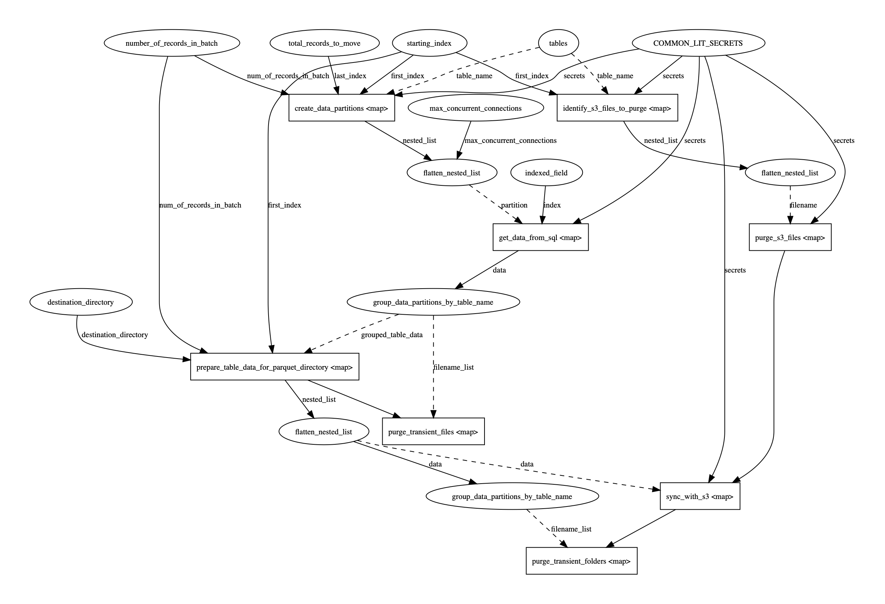

# postgres-to-s3

This is a Prefect Flow designed to iteratively pull data from a Postgres server running on AWS RDS service,
and push the data to S3 as partitioned parquet files.

## DAG



## Connection details

The connection details for both Postgres and s3 are stored in a Prefect Secret in the following format:

```json
{
    "database_user": "...",
    "database_pass": "...",
    "database_host": "...rds.amazonaws.com",
    "database_port": "...",
    "database_name": "...",
    "database_schema": "...",
    "s3_access_key": "...",
    "s3_secret_key": "...",
    "s3_server": "...",
    "s3_bucket": "..."
}
```

## Flow Parameters

You can adjust the following Prefect Parameters:

- tables = List of strings containing table names you want to move
- indexed_field = String indicating which field is indexed in all of the tables to be moved
- starting_index = Integer indicating which index you want to start moving at
- total_records_to_move = Integer indicating how many rows you want to include in this Flow Run
- number_of_records_in_batch = Integer indicating when distributing the workload across multiple workers, how large should each batch be?